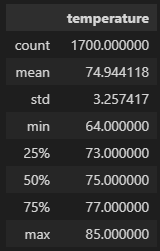
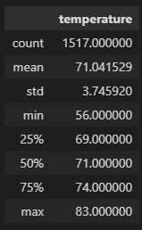

# Hawaii Weather Analysis
## Overview
The purpose of this challenge is to analyze the overall weather data in Oahu, Hawaii, including temperature and precipitation.  In particular, we were asked to analyze temperature trends over a seven year span (2010 - 2017) for the months of June and December.  The purpose of the analysis is to determine if a surf and ice cream shop business would be sustainable year round.  Presumably we'd like to answer the questions:

- Is it warm enough in December to sell ice cream in Oahu, Hawaii?
- Is it cool enough in June for outside sports in Oahu, Hawaii?

### Resources
- Data Sources: hawaii.sqlite
- Software: Python 3.8.8, Jupyter notebook 6.4.0, Jupyter lab 3.0.16, VSCode 1.59.0

## Results
Using the data below, we can see that there are some significant, and many minor weather differences between the months of June and December:
- There is only approximately an 11% difference between the number of temperature observations in December and January.
- The maximum observed temperature for the two months differs by only two degrees.
- The minimum observed temperature, however, differs by 8°.
- The average temperature in December is 71°, and in June is 71°.
- The minimum observed temperature in December is still above 55°.

June Weather Statistics:

December Weather Statistics:

## Summary
The relatively mild temperatures in both June and December suggest an ideal surfing climate year round.  Even in the colder December month, the average temperature is a very pleasant 71°.  The lowest recorded December temperature over the seven-year span is 56°, which would be tolerable to surf in a wetsuit.

The average June and December temperatures are 75° and 71° respectively.  That would indicate that Oahu, Hawaii has remarkably consistent weather throughout the calendar year.  The low temperature in December is fairly low at 56°, but the average of 71° is plenty warm enough for ice cream.

## Further Analysis
If the reader is interested in further analysis, I would recommend the following additional queries:
- An analysis of the preciptation data for Oahu, Hawaii.  Although temperature certainly affects customers' interested in ice cream and watersports, preciptation can harm the profitability of a business as well.
- In addition, I would query the humidity of the area, or perhaps the heat index.  Although an average high of 75 sounds blissful, a high humidity percentage could turn a delightful afternoon treat into a sticky afternoon in which customers would rather have dessert indoors.
